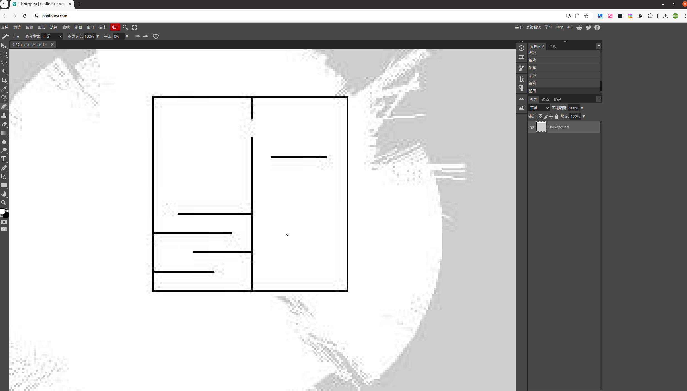
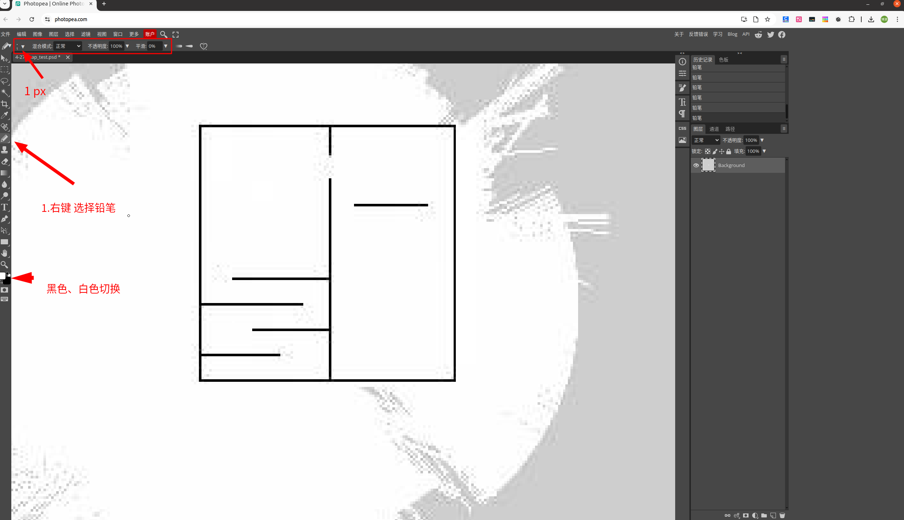

@[TOC](【ROS】编辑 .pgm 导航栅格地图)
# 前言
在比赛或项目中，导航用的栅格地图精度非常重要。但由于 IMU 漂移、里程计误差、地面打滑等问题，用 GMapping 或 Hector 建图时常会出现偏差。这时，我们就需要手动修改生成的 `.pgm` 地图，提升导航效果。

**本文介绍如何用轻量化的在线 PS 工具，简单地编辑和优化导航地图**

---
# 第一章：从像素到路径——深入理解ROS导航地图

在动手编辑之前，我们必须先弄清一个根本问题：ROS是如何将一张看似普通的`.pgm`灰度图，解读为机器人能够遵循的导航地图的？这其中涉及一个从像素到概率，再到最终路径成本的转换过程。

## 1.1 地图的本质：一张代表概率的矩阵

从文件形式上看，ROS导航地图是一张`.pgm`格式的图片。但其核心是一个 **n行m列的二维矩阵**。矩阵中的每一个单元格，即图片中的一个像素，都存储了一个**灰度值（0-255）**。这个值并非简单的颜色，而是代表了该物理位置**存在障碍物的可能性**。

## 1.2 解读过程：从灰度值到“黑白灰”三态

当ROS的`map_server`节点加载这张地图时，它会执行一个关键的“翻译”流程，将原始的灰度信息转换为机器人可以理解的三种状态：

1.  **概率转换：**
    首先，`map_server`会将每个像素`0`到`255`的灰度值，通过公式 `概率 = 1.0 - (灰度值 / 255.0)`，转换为一个`0.0`到`1.0`之间的**占用概率 (Occupancy Probability)**。
    *   **纯黑 (灰度=0):** 对应概率`1.0`，代表100%确定是障碍物。
    *   **纯白 (灰度=255):** 对应概率`0.0`，代表完全空闲。
    *   **灰色:** 对应`0.0`到`1.0`之间的不确定概率。

2.  **阈值判断：**
    接着，`map_server`会读取配套`.yaml`配置文件中的两个核心阈值：
    *   `occupied_thresh`: 占用阈值 (例如 `0.65`)
    *   `free_thresh`: 空闲阈值 (例如 `0.196`)

    它用上一步得到的概率与阈值进行比较，最终确定每个单元格的状态：
    *   **占用 (Obstacle):** 如果概率 > `occupied_thresh`。
    *   **空闲 (Free Space):** 如果概率 < `free_thresh`。
    *   **未知 (Unknown):** 如果概率介于`free_thresh`和`occupied_thresh`之间。

## 1.3 核心结论：我们编辑的终极目标

理解了上述过程，我们编辑地图的**本质**就非常清晰了：**精确地修改`.pgm`文件中每个像素的颜色，从而控制其最终被判定的状态。**

为了让ROS能够明确无误地解析地图，最佳实践就是创造一个“黑白分明”的世界：
*   **障碍物区域 → 纯黑色 (灰度=0)**
*   **可通行区域 → 纯白色 (灰度=255)**

## 1.4 深度剖析：机器人如何看待“灰色地带”？

“未知区域”（灰色）在导航中扮演了一个特殊的角色。机器人的行为逻辑如下：

*   **全局规划器：视为障碍。** 在制定宏观路径时，全局规划器会将未知区域视为高成本的障碍物。这是出于安全第一的原则，因此生成的全局路径会主动绕开所有灰色地带。
*   **局部规划器：谨慎避让。** 局部规划器的首要任务是紧密跟随全局路径。即使传感器探测到旁边的未知区域实际是空地，它也不会擅自闯入。其行为是**保守的**，会尽可能贴合“官方路线”，而不会主动去探索捷径。

这一机制带来的实践指导意义是：**在建图和地图编辑时，应尽力消除模糊的灰色像素。** 一个清晰、黑白分明的地图，是机器人流畅、高效导航的有力保障，能有效避免因路径成本过高导致的导航失败或行为异常。

---
# 第二章：实战演练——像P图一样编辑你的地图

掌握了基本原理，现在就让我们卷起袖子，亲自“装修”一张栅格地图吧！

**推荐工具：** [Photopea](https://www.photopea.com/) (在线网站)
*   **理由：** 免费、无需安装、功能强大。完美满足我们的需求，无需下载动辄数G的Photoshop，避免“大炮打蚊子”。

## 操作四步走

**第一步：打开地图**
直接将你的`.pgm`地图文件拖拽进Photopea窗口，或者通过顶部菜单【文件】->【打开】来加载。

**第二步：选择并设置核心工具——铅笔**
*   **为什么不用画笔工具(Brush Tool)？**
    因为画笔工具的边缘默认是**柔和、有羽化效果的（抗锯齿）**。这会在你绘制的线条边缘产生我们极力想避免的**灰色过渡像素**，给地图带来不必要的“未知区域”，从而影响导航效果。
    
在左侧工具栏中，找到并选择 **【铅笔工具】**。然后在顶部工具栏中，设置 **【大小】** 为 `1px`。

**第三步：开始编辑**
现在，你可以像像素画家一样，对地图进行精修：
*   **绘制障碍：** 将前景色设置为**纯黑色**，在需要添加障碍的地方进行描绘。
*   **开辟通路：** 将前景色设置为**纯白色**，在需要清除障碍的地方进行描绘。

**第四步：导出**
编辑完成后，**切勿直接保存！** 必须按照以下路径进行导出操作：
在顶部菜单栏选择 **【文件】 -> 【导出为】 -> 【PNG】**

> 注：PNG 是一种无损压缩格式，选择 PNG 是为了确保每一个像素的编辑结果都能完整保留，不会像 JPG 那样产生压缩失真。我们将在下一步中利用这一无损特性，将其转换为 PGM 文件。

**第五步：转换**
在 [Convertio](https://convertio.co/png-pgm/) 在线网站中，将导出的 PNG 格式图片转换为 PGM 格式，确保地图结构和像素信息完整保留，便于后续在导航中使用。

---

## 实用小技巧

*   **放大缩小：** 按住 `Alt` 键，同时滚动鼠标滚轮。
*   **快速切换黑白：** 按键盘上的 `X` 键，可以快速互换前景色和背景色（即画笔的黑白颜色）。
*   **绘制完美直线：** 用铅笔先点击一个点，然后按住 `Shift` 键，再点击另一个点，即可连接一条完美的直线墙壁。
*   **大面积处理：** 使用【矩形选框工具】框选一片区域后，按 `Alt + Delete` 可用前景色填充，按 `Ctrl + Delete` 可用背景色填充。这是绘制大片矩形障碍或清理大片空白区域的神器！

